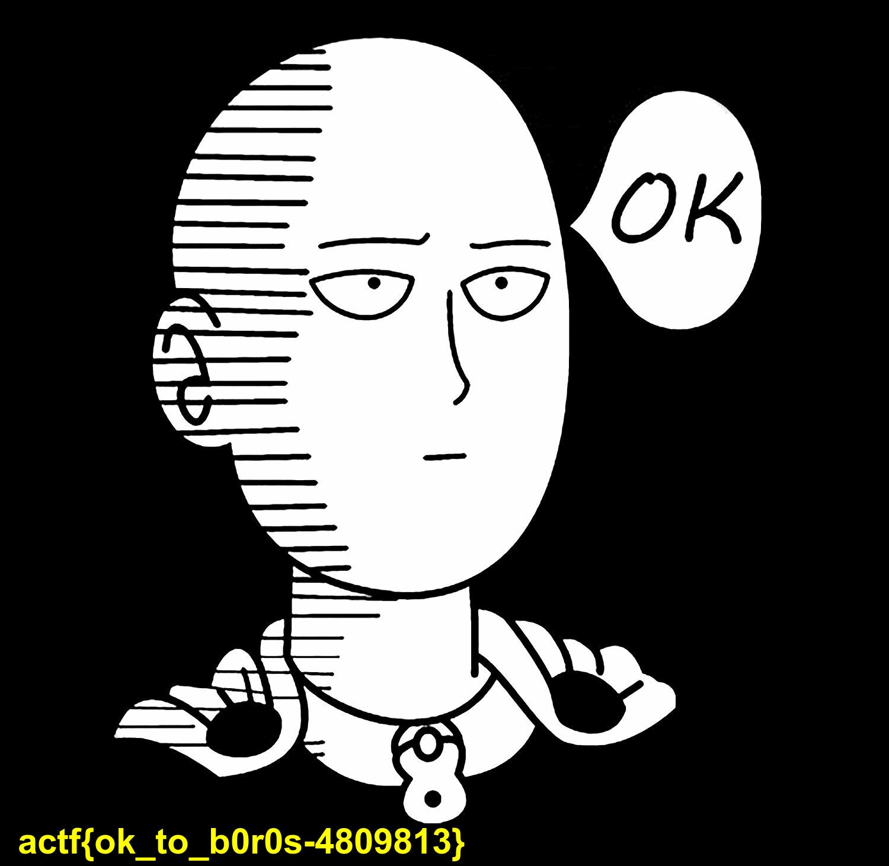

[AngstromCTF](https://2020.angstromctf.com/challenges) - Misc
===============

CHALLENGES
----------------------

3. [ ws1 ](#ws1)
4. [ clam clam clam ](#clam)
5. [ ws2 ](#ws2)

## 3. ws1 (30 points)

**Challenge description**

Find my password from this recording (:

**Solution**
"ws1" is a reference to Wireshark.
The attached recording.pcapng can be opened with Wireshark to see the recording of the internet traffic. Manually looking trough the data showed the flag pretty quick.

Flag: actf{wireshark_isn't_so_bad_huh-a9d8g99ikdf}

## 4. clam clam clam (70 points)

**Challenge description**

clam clam clam clam clam clam clam clam clam `nc misc.2020.chall.actf.co 20204` clam clam clam clam clam clam

**Hint**

`U+000D`

**Solution**

Using netcat to connect to the port results in a spam of `c{malc_malc_malc_malc_malc}\nclam{clam_clam_clam_clam_clam}\n`. I used the python script clam.py to process the incoming spam better.  When scrolling trough the spam the text `type "clamclam" for salvation` showed up, I guess one could automate to recognize other characters than clam{}/n_.
Typing `clamclam` in the terminal is no easy feat with the spam going on. With python this is easily done (don't forget to send the `/n`!).

Flag: actf{cl4m_is_my_f4v0rite_ctfer_in_th3_w0rld}

## 5. ws2 (80 points)

**Challenge description**

No ascii, not problem :)

recording.pcapng

**Hint**
` What did I send? `

**Solution**
Second part of the wireshark challenge. This time an image shows up as being uploaded (line no 64). The image can be saved by going to File -> Export objects -> HTTP.

The file isn't recognized as an image file because of a WebKitFormBoundary header. After deleting this header (first 4 lines and the last line) the image shows up correctly:

