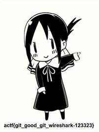

[AngstromCTF](https://2020.angstromctf.com/challenges) - Misc
===============

CHALLENGES
----------------------

3. [ ws1 ](#ws1)
4. [ clam clam clam ](#clam)
5. [ ws2 ](#ws2)
9. [ Shifter ](#shifter)
10. [ ws3 ](#ws3)


<a name="ws1"></a>
## 3. ws1 (30 points)

**Challenge description**

Find my password from this recording (:

**Solution**

"ws1" is a reference to Wireshark.
The attached recording.pcapng can be opened with Wireshark to see the recording of the internet traffic. Manually looking trough the data showed the flag pretty quick.

Flag: actf{wireshark_isn't_so_bad_huh-a9d8g99ikdf}


<a name="clam"></a>
## 4. clam clam clam (70 points)

**Challenge description**

clam clam clam clam clam clam clam clam clam `nc misc.2020.chall.actf.co 20204` clam clam clam clam clam clam

**Hint**

`U+000D`

**Solution**

Using netcat to connect to the port results in a spam of `c{malc_malc_malc_malc_malc}\nclam{clam_clam_clam_clam_clam}\n`. I used the python script clam.py to process the incoming spam better.  When scrolling trough the spam the text `type "clamclam" for salvation` showed up, I guess one could automate to recognize other characters than clam{}/n_.
Typing `clamclam` in the terminal is no easy feat with the spam going on. With python this is easily done (don't forget to send the `/n`!).

Flag: actf{cl4m_is_my_f4v0rite_ctfer_in_th3_w0rld}

<a name="ws2"></a>
## 5. ws2 (80 points)

**Challenge description**

No ascii, not problem :)

recording.pcapng

**Hint**

` What did I send? `

**Solution**

Second part of the wireshark challenge. This time an image shows up as being uploaded (line no 64). The image can be saved by going to File -> Export objects -> HTTP.

The file isn't recognized as an image file because of a WebKitFormBoundary header. After deleting this header (first 4 lines and the last line) the image shows up correctly:


Flag: actf{ok_to_b0r0s-4809813}

<a name="shifter"></a>
## 9. Shifter (160 points)

**Challenge Desciption**

What a strange challenge...

It'll be no problem for you, of course!

`nc misc.2020.chall.actf.co 20300`

**Hint**

`Do you really need to calculate all those numbers?`

**Solution**

The port returns a series of 50 challenges like:

```
Solve 50 of these epic problems in a row to prove you are a master crypto man like Aplet123!
You'll be given a number n and also a plaintext p.
Caesar shift `p` with the nth Fibonacci number.
n < 50, p is completely uppercase and alphabetic, len(p) < 50
You have 60 seconds!
--------------------
Shift DXWREJZUFLJWVB by n=6
```
I made the script shifter.py which does calculate the fibonacci numbers and encrypts the plaintext with ceasar and the shift. When time is restricted and the n is limited I guess I could also have googled or calculated the 50 terms.

Flag: actf{h0p3_y0u_us3d_th3_f0rmu14-1985098}


<a name="ws2"></a>
## 10. ws3 (180 points)

**Challenge description**

What the... record.pcapng

**Hint**

Did I send something? Or...

**Solution**

Open the record.pcapng with wireshark and export all http objects.
Binwalk the biggest file and export it with:

`binwalk -e git-receive-pack`

To get the image:



Flag: actf{git_good_git_wireshark-123323}
