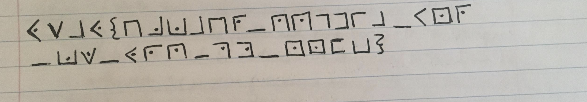

[RiceTeaCatPanda](https://riceteacatpanda.wtf/challenges) - Cryptography
===============

CHALLENGES
----------------------

1. [ HOOOOOOOOOOMEEEEEE RUNNNNNNNNNNNNN!!!!! ](#home_run)
2. [ Don't Give The GIANt a COOKie ](#giant_cookie)
3. [ 15 ](#15)
4. [ notice me senpai ](#notice)
5. [ Wrong Way ](#wrong)
6. [ That's Some Interesting Tea(rs)....... ](#tears)
7. [ That's a Lot of Stuff . . . ](#stuff)
8. [ Pandas Like Salads ](#salads)

<a name="home_run"></a>
## 1. HOOOOOOOOOOMEEEEEE RUNNNNNNNNNNNNN!!!!! (50 points)

**Challenge description**

AND JAKE IS ROUNDING THE BASES \
HE PASSES BASE 32!!! \
HE ROUNDS BASE 64!!!!!!! \
WE'RE WITNESSING A MIRACLE!!!!!!!!!!!!!

Just one more base to go ;D

**Hint**

```
Ecbf1HZ_kd8jR5K?[";(7;aJp?[4>J?Slk3<+n'pF]W^,F>._lB/=r
```

**Solution**

The flag is [Base85](https://en.wikipedia.org/wiki/Ascii85) (also named Ascii85) encoded. 
Decode either with Python (see home_run.py - using the base64 python package) or use an online tool like [cryptii](https://cryptii.com/).

Flag: rtcp{uH_JAk3_w3REn't_y0u_4t_Th3_uWust0r4g3}

<a name="giant_cookie"></a>
## 2.Don't Give The GIANt a COOKie (100 points)

**Challenge description**

It was just a typical day in the bakery for Delphine. She was preparing her famous chocolate cake, when all of a sudden a GIANt burst through the doors of her establishment and demanded a cookie. Being the strong-willed girl she was, Delphine refused and promptly threw her rolling pin at the GIANt. Doing what any sensible being would do when faced with projectiles, the GIANt let out a shriek and ran out of the shop. Delphine smiled to herself, it was another day well done.

But oh? What's this? It seems the GIANt dropped this behind while he was screaming and scrambling out of the shop.

```
69acad26c0b7fa29d2df023b4744bf07
```

**Hint**

This challenge still follows typical flag format, just wrap your answer with rtcp{answer_here}.

Non-case sensitive.

**Solution**

The secret consists of 32 hexadecimal digits which indicates a 128-bit (16-byte) [MD5](https://en.wikipedia.org/wiki/MD5) hash. Alot of MD5 hashes (including this one) can be decrypted with [online decoders](https://www.md5online.org/md5-decrypt.html). 


Flag: `rtcp{chocolate_mmm}`

<a name="15"></a>
## 3. 15 (100 points)

**Challenge description**
```
Lhzdwt eceowwl: Dhtnwt Pcln Eaao Qwoohvw

Okw qsyo okcln bah'i fslo cl baht Dhtnwt Pcln dhtnwt cy yazwalw'y eaao ehlnhy. Dho sy co ohtly aho, okso zcnko dw fkso bah nwo. S 4vksllwt hmqasiwi s mkaoa slalbzahyqb oa okw ycow ykafvsycln kcy ewwo cl s mqsyocv dcl ae qwoohvw, fcok okw yosowzwlo: "Okcy cy okw qwoohvw bah wso so Dhtnwt Pcln." Sizcoowiqb, kw ksi ykawy al. Dho okso'y wgwl fatyw.

Okw mayo fwlo qcgw so 11:38 MZ al Xhqb 16, sli s zwtw ofwlob zclhowy qsowt, okw Dhtnwt Pcln cl rhwyocal fsy sqwtowi oa okw tanhw wzmqabww. So qwsyo, C kamw kw'y tanhw. Kaf ici co ksmmwl? Fwqq, okw DP wzmqabww ksil'o twzagwi okw WJCE isos etaz okw hmqasiwi mkaoa, fkcvk yhnnwyowi okw vhqmtco fsy yazwfkwtw cl Zsbecwqi Kwcnkoy, Akca. Okcy fsy so 11:47. Oktww zclhowy qsowt so 11:50, okw Dhtnwt Pcln dtslvk siitwyy fsy mayowi fcok fcykwy ae ksmmb hlwzmqabzwlo. Ecgw zclhowy qsowt, okw lwfy yosocal fsy valosvowi db slaokwt 4vksllwt. Sli oktww zclhowy qsowt, so 11:58, s qclp fsy mayowi: DP'y "Owqq hy sdaho hy" alqclw eathz. Okw eaao mkaoa, aokwtfcyw plafl sy wjkcdco S, fsy soosvkwi. Vqwgwqsli Yvwlw Zsnsuclw valosvowi okw DP cl rhwyocal okw lwjo isb. Fkwl rhwyocalwi, okw dtwspesyo ykceo zslsnwt ysci "Ak, C plaf fka okso cy. Kw'y nwoocln ectwi." Zbyowtb yaqgwi, db 4vksl. Laf fw vsl sqq na dsvp oa wsocln aht esyo eaai cl mwsvw.

tovm{v4T3Ehq_f1oK_3J1e_i4O4}
```
Challenge Author: Jess (the other one)/J

**Solution**

The challenge text seems to have the spaces in the right place but the characters seem translated. This text is written with a substitution cipher. With this kind of cipher more text than the flag alone is needed to decrypt it. [Guballa](https://www.guballa.de/substitution-solver) can be used to decode this substitution cipher and supports mulitple languages. It gives the decrypted text and the used encryption key:

```
abcdefghijklmnopqrstuvwxyz     This clear text ...
sdviwenkcxpqzlamrtyohgfjbu     ... maps to this cipher text
```

[Quipquip](https://quipqiup.com/) is another tool to solve these substitution ciphers and has an input field for clues such as `tovm=rtcp`. This solver had more difficulties with uppercase characters, luckily the flag submissions for this ctf are case insensitive.

Flag: `rtcp{c4r3ful_w1th_3x1f_d4t4}`

<a name="notice"></a>
## 4. notice me senpai (100 points)

**Challenge description**

uwu...senpai placed this note on my desk before class but i cant wead what it says!!!!!! can you hewp me????????? uwu tysm

`tlyrc_o_0pnvhu}{137rmi__i_omwm`

Challenge Author: Jess (the other one)/J

**Solution**

The characters of the flag are scrambled in their order but with the right characters. Using [Railfence]('http://rumkin.com/tools/cipher/railfence.php') the flag can be decrypted with 6 rails and an offset of 9. 

Flag: `rtcp{im_1n_lov3_wi7h_y0ur_mom}`

Their are different ciphers which scamble characters with similar looking results. Trying the different tools mentioned in [John Hammonds ctf-katana](http://rumkin.com/tools/cipher/railfence.php) would be a great start for these kind of encryptions.

<a name="wrong"></a>
## 5. Wrong Way (150 points)

**Challenge description**

Did you know that you've been going the wrong way entire time?

`E7Rq<G:Kǒ`

**Hint**

Format in rtcp{} format, adding _ underscores as needed. The flag should be case insensitive

**Solution**

To get the flag encode (instead of decode) the message with base64 either with the python package base64 or an online tool.

Flag: rtcp{unexpected_places}

<a name="tears"></a>
## 6. That's Some Interesting Tea(rs)....... (175 points)

**Challenge description**

You know, the tears of one's enemies works lovely in tea. Turns out, there's tons of different bases for tea. In fact, I think I heard Delphine talk about this chef website she used for her tea base combinations. . .

Oh! Speaking of which, GIANt wants Delphine to make him tea. . . all he has is the tea leaves and the cup though. Maybe you can help Delphine, since she's really busy with cooking other things?

`
O53GG4CSJRHEWQT2GJ5HC4CGOM4VKY3SOZGECZ2YNJTXO6LROV3DIR3CK4ZEMWCDHFMTOWSXGRSHU23DLJVTS5BXOQZXMU3ONJSFKRCVO5BEGVSELJSGUNSYLI2XQ32UOI3FKWDYMJQWOMKQOJ4XIU2WN5KTKWT2INUW44SZONGUUN2BMFRTQQJYKM3WGSSUNVXGEU3THFIFUSDHIVWVEQ3LJVUXEMSXK5MXSZ3TG5JXORKTMZRFIVQ=
`

**Solution**

Secret has all capital characters, doesn't use all the numbers (only 2-7) and has a equal sign at the end for padding. This suggest a base32 encoded message. Since this challenge will require multiple decodings it might be more convenient to use [CyberChef](https://gchq.github.io/CyberChef/) rather than python.

From Base32 returns:

`
wvcpRLNKBz2zqpFs9UcrvLAgXjgwyquv4GbW2FXC9Y7ZW4dzkcZk9t7t3vSnjdUDUwBCVDZdj6XZ5xoTr6UXxbag1PrytSVoU5ZzCinrYsMJ7Aac8A8S7cJTmnbSs9PZHgEmRCkMir2WWYygs7SwESfbTV
`

This output looks like a higher base than 32, after some different attempts Base58 returns:

`
BGJz4dCH0UuQZ2Q9vLExJUKcrvdIoYRwrspUSms5eRJoVc3WAztlKjjkEXDJuI1uqXQT3OdCcm8LjC12gR3Fd1EfZ2isyNxfe55MiOvz2DYGDb9dh
`

This output from Base62:

`
RWNiZjFIWldwWEY+W0RfMFByVVEyKUssa0ghYllMMWdfdEVAVmRsPDFMRHRUQ2dWOXQwUVQkV0Y+R2FvRisi
`

This output from Base64:
`
Ecbf1HZWpXF>[D_0PrUQ2)K,kH!bYL1g_tE@Vdl<1LDtTCgV9t0QT$WF>GaoF+"
`

This output from Base85:
`
rtcp{th4t5_50m3_54lty_t34_1_bl4m3_4ll_th0s3_t34rs}
`

Flag: rtcp{th4t5_50m3_54lty_t34_1_bl4m3_4ll_th0s3_t34rs}

<a name="stuff"></a>
## 7. That's a Lot of Stuff . . . (270 points)

**Challenge description**

Do you want some numbers? Here, take these numbers. I don't need them anyways. I have too many numbers at home, so go on, take them. Shoves numbers towards the computer screen

`
31 34 33 20 31 35 36 20 31 32 32 20 31 35 32 20 31 34 33 20 31 31 30 20 31 36 34 20 31 35 32 20 31 31 35 20 31 30 37 20 36 35 20 36 32 20 31 31 35 20 36 33 20 31 31 32 20 31 37 32 20 31 31 35 20 31 32 34 20 31 30 32 20 31 36 35 20 31 34 33 20 36 31 20 37 31 20 31 35 30 20 31 34 33 20 31 35 32 20 31 31 36 20 31 34 36 20 31 31 36 20 31 30 36 20 37 31 20 31 35 32 20 31 31 35 20 31 30 34 20 31 30 32 20 31 31 35 20 31 33 30 20 36 32 20 31 31 35 20 36 30 20 31 34 34 20 31 31 30 20 31 31 36 20 37 31
`

**Solution**

These numbers have a certain pattern to them. It could be [Octal](https://en.wikipedia.org/wiki/Octal) since none are higher than 8 but this returns nothing interesting. The 20's in Hex would translate to a spaces. Trying From Hex on [CyberChef](https://gchq.github.io/CyberChef/) returns more numbers:

`
143 156 122 152 143 110 164 152 115 107 65 62 115 63 112 172 115 124 102 165 143 61 71 150 143 152 116 146 116 106 71 152 115 104 102 115 130 62 115 60 144 110 116 71
`

This is octal, using From Octal returns:

`
cnRjcHtjMG52M3JzMTBuc19hcjNfNF9jMDBMX2M0dHN9
`

Based on the upper- and lowercase characters aswell as 0-9 numbers suggest a high base encoding. Using from Base64 returns the flag:

`
rtcp{c0nv3rs10ns_ar3_4_c00L_c4ts}
`

Flag: rtcp{c0nv3rs10ns_ar3_4_c00L_c4ts}

<a name="salads"></a>
## 8. Pandas Like Salads (350 points)

**Challenge description**

Did you know a new panda was added to the Washington DC zoo recently? Yep, apparently she really like salads. Interesting, yeah? Also, the panda keepers of the zoo said that the key to happiness in life is a little CUTENESS every day. You know, all the keepers who are on the panda's rotation all said the same thing to me. Very interesting.

